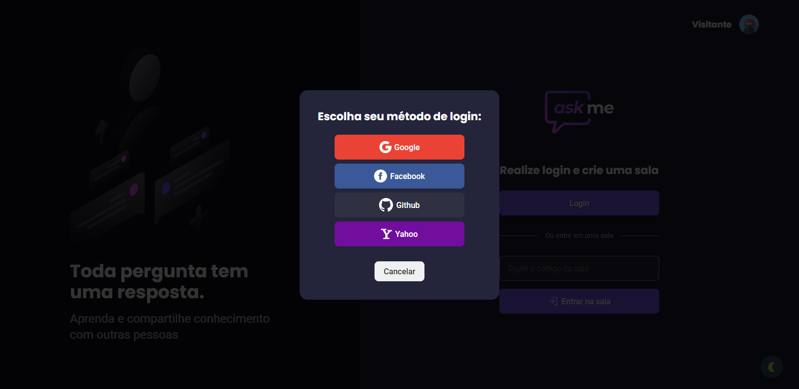
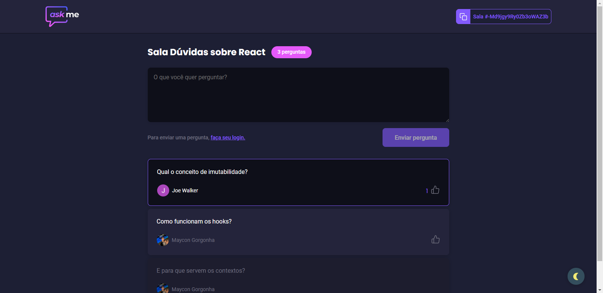
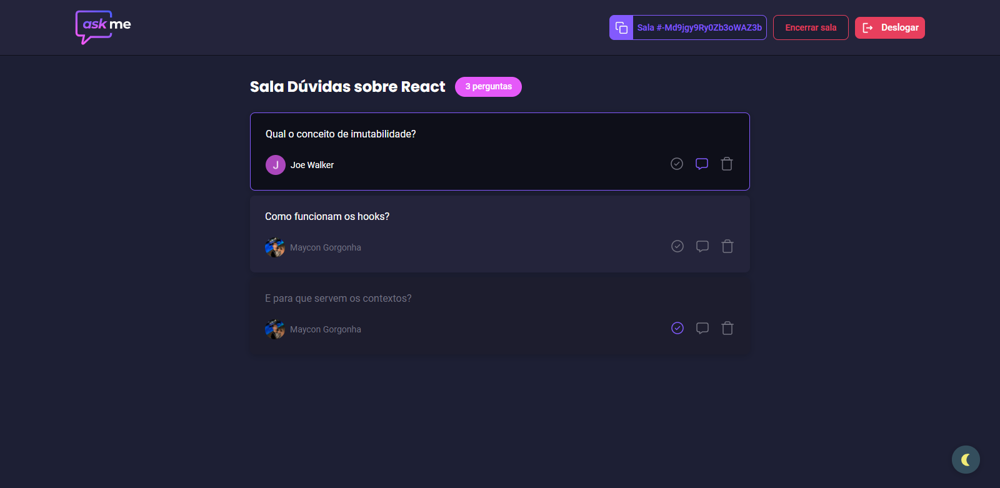

  

<h3 align="center">
  Application preview:
  <a href="https://askme.vercel.app/">
    Ask Me
  </a>
</h3>

 

  

 

## Sobre o Projeto

Este projeto visa a auxiliar pessoas, como por exemplo um streamer, a sanar as dúvidas de sua audiência em tempo real. Onde um usuário pode criar uma sala, compartilhar o código desta sala para que outros possam entrar e enviar suas perguntas, além de votar nas que acharem mais relevantes.

 

## 🚀 Tecnologias Utilizadas

- [Node.js](https://nodejs.org/en)
- [TypeScript](https://www.typescriptlang.org)
- [Firebase](https://firebase.google.com/docs)
- [ReactJS](https://reactjs.org)
- [React Hooks](https://reactjs.org/docs/hooks-intro.html)
- [React Context API](https://reactjs.org/docs/context.html)
- [React Hot Toast](https://react-hot-toast.com)
- [React Router DOM](https://reactrouter.com/web/guides/quick-start)
- [Styled Components](https://styled-components.com/docs)

 

## 🎨 Layout preview

<!-- 🏗️👷‍♂️🚧⚠️ Em construção...⚠️🚧👷‍♂️🏗️ -->

 

## ✅ Feature

- **[ done ]** Autenticação com contas Google, Facebook, GitHub e Yahoo
- **[ done ]** Criar sala de perguntas e respostas (se autenticado)
- **[ done ]** Fechar sala (se autenticado como autor da sala)
- **[ done ]** Entrar em uma sala
- **[ done ]** Enviar pergunta (se autenticado)
- **[ done ]** Carregar perguntas do BD em tempo real
- **[ done ]** Reagir a uma pergunta (se autenticado e não sendo o autor da sala)
- **[ done ]** Destacar pergunta (se autenticado como autor da sala)
- **[ done ]** Marcar pergunta como respondida (se autenticado como autor da sala)
- **[ done ]** Excluir pergunta (se autenticado como autor da sala)
- **[ done ]** Mudança de tema (dark e light) com gravação no localStorage.

 

 

# 😯 Como contribuir para o projeto

1. Faça um Fork do projeto
   Crie uma Branch para sua Feature (git checkout -b feature/FeatureIncrivel)
2. Adicione suas mudanças (git add .)
3. Comite suas mudanças (git commit -m 'Adicionando uma Feature incrível!)
4. Faça o Push da Branch (git push origin feature/FeatureIncrivel)
5. Abra uma Pull Request

> Caso tenha alguma dúvida confira este [guia de como contribuir no GitHub](https://github.com/firstcontributions/first-contributions)

---

<h4 align="center">
    Feito com 💜 por Maycon Gorgonha 👋🏽 <a href="https://www.linkedin.com/in/maycon-gorgonha/" target="_blank">Entre em contato!</a>
<h4>

MIT License © <a href="https://github.com/maycongc">Maycon Gorgonha</a>

